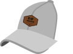

# MunchHat Map



A Discord bot that drops a hat pin on a live map every time someone posts a photo with `#munchhat` or `#munchhatchronicles`. Browse the map at **[munchhatmap.dotheneedful.dev](https://munchhatmap.dotheneedful.dev)**.

---

## How It Works

1. Post a photo in Discord with `#munchhat` or `#munchhatchronicles`.
2. The bot determines the location using a three-step pipeline (see [Geocoding](#geocoding) below).
3. A hat pin is dropped on the map at that location with your photo, username, and a link back to the original message.
4. Use `/munchhat-import message:<url>` to import a specific past post by its Discord message link.

> The bot also fires when a message is **edited** to add the tag or attach an image — useful when the tag or photo is added after the initial post.

---

## Architecture

| Component | Azure Service | Estimated Cost |
|---|---|---|
| Discord bot (persistent Gateway) | Azure Container Apps (Consumption) | ~$10–15/month |
| Geocoding & image recognition | Azure OpenAI (gpt-4o-mini, Standard) | Pay-per-token (~$0/month at low volume) |
| Map API | Azure Functions (Consumption) | Free tier |
| Map frontend (Leaflet + OpenStreetMap) | Azure Static Web Apps (Free) | Free |
| Database | Azure Cosmos DB (Free tier) | Free |
| Secrets | Azure Key Vault (Standard) | ~$0.03/month |

**Total estimated cost: ~$10–15/month** (driven by Container Apps for the persistent Discord Gateway connection).

---

## Geocoding

Location is resolved in three steps, in order:

1. **GPS EXIF** — if the attached photo has embedded GPS coordinates, they are extracted directly and reverse-geocoded to country/state via Azure OpenAI.
2. **Text geocoding** — if no EXIF data is found, the message text (minus the trigger tag, capped at 300 characters) is sent to Azure OpenAI (`gpt-4o-mini`) with a structured prompt asking for precise coordinates, place name, country, and US state. The model attempts to return the most specific location it can — a named landmark, restaurant, or neighborhood rather than just a city.
3. **Vision geocoding** — if text geocoding returns no result, the attached photo is sent to Azure OpenAI with image recognition enabled (`detail: low`) and the model attempts to identify the location from visual cues.

If none of the three steps resolve a location, the message is reported as unmapped in the import summary or bot reply.

All geocoding calls return `{lat, lng, country, state, place_name}` in a single API call. `state` is only populated for US locations.

---

## Repository Layout

```
.
├── .github/workflows/
│   ├── deploy-bot.yml          Build & push Docker image → Container App (SHA-tagged, npm audit)
│   ├── deploy-api.yml          Build & deploy Azure Functions (npm audit)
│   ├── deploy-frontend.yml     Deploy static site to Azure Static Web Apps
│   └── deploy-infrastructure.yml  Bicep IaC deployment + auto-triggers bot & API redeploy
├── infra/                      Bicep infrastructure-as-code
│   └── modules/
│       ├── openai.bicep        Azure OpenAI resource + gpt-4o-mini deployment
│       └── ...
├── bot/                        Discord Gateway bot (Node.js / TypeScript)
│   ├── src/
│   │   ├── handlers/
│   │   │   ├── aoai.ts                Azure OpenAI geocoding (text, vision, reverse)
│   │   │   ├── pinProcessor.ts        Three-step geocoding pipeline
│   │   │   ├── messageHandler.ts      Live messageCreate handler
│   │   │   ├── messageUpdateHandler.ts  messageUpdate handler (edits with tag/image)
│   │   │   ├── importHandler/         /munchhat-import slash command (split into modules)
│   │   │   ├── exif.ts                GPS EXIF extraction
│   │   │   └── db.ts                  Cosmos DB reads/writes
│   │   └── types/mapPin.ts
│   └── Dockerfile
├── api/                        Azure Functions API (TypeScript)
│   └── src/
│       ├── functions/
│       │   ├── getPins.ts         GET /api/getPins
│       │   ├── getStats.ts        GET /api/getStats
│       │   ├── updatePin.ts       PATCH /api/updatePin
│       │   ├── deletePin.ts       DELETE /api/deletePin
│       │   ├── authLogin.ts       GET /api/auth/login
│       │   ├── authCallback.ts    GET /api/auth/callback
│       │   ├── authExchange.ts    GET /api/auth/exchange
│       │   ├── authLogout.ts      GET /api/auth/logout
│       │   └── authMe.ts          GET /api/auth/me
│       └── shared/
│           ├── auth.ts            JWT sign/verify, session user, guild membership
│           ├── db.ts              Cosmos DB client + pin CRUD helpers
│           ├── aoai.ts            Reverse geocoding for pin relocation
│           └── response.ts        Shared CORS headers + JSON/redirect response helpers
├── frontend/                   Static map page (HTML + vanilla JS + Leaflet)
│   ├── index.html
│   ├── munchhat.png            Hat logo (favicon, header, map markers)
│   └── js/
│       ├── main.js             Auth flow, pin fetch, user filter control
│       ├── config.js           Runtime config (API base URL)
│       ├── map.js              Leaflet map + markercluster + drag/delete interaction
│       └── stats.js            Stats panel (leaderboard, states, countries)
├── munchhat.png                Brand logo
├── .env.example
└── README.md
```

---

## Setup

### 1. Discord Application

1. Go to [Discord Developer Portal](https://discord.com/developers/applications) → **New Application**.
2. Name it **MunchHat Map**.
3. **Bot** tab → **Add Bot** → copy the **Token** (= `DISCORD_BOT_TOKEN`).
4. Enable **Privileged Gateway Intents**:
   - ✅ **MESSAGE CONTENT INTENT** (required to read `#munchhat` tags)
5. **OAuth2 → URL Generator**:
   - Scopes: `bot`, `applications.commands`
   - Bot Permissions: `View Channels`, `Read Message History`, `Send Messages`
   - Copy the generated URL and invite the bot to your server.

### 2. Azure Infrastructure

**Prerequisites:** Azure CLI, Bicep CLI, an Azure subscription.

```bash
az login

az group create --name rg-munchhatmap-prod --location centralus

az deployment group create \
  --resource-group rg-munchhatmap-prod \
  --template-file infra/main.bicep \
  --parameters repositoryUrl=https://github.com/YOUR_ORG/munchhatmap
```

> ⚠️ **Cosmos DB free tier**: Only one free-tier Cosmos DB account is allowed per Azure subscription.
> Remove `enableFreeTier: true` from `infra/modules/cosmosdb.bicep` if you already have one.

### 3. Add Secrets to Key Vault

```bash
KV=munchhatmap-kv-prod

az keyvault secret set --vault-name $KV --name discord-bot-token          --value "YOUR_BOT_TOKEN"
az keyvault secret set --vault-name $KV --name discord-oauth-client-secret --value "YOUR_OAUTH_CLIENT_SECRET"
az keyvault secret set --vault-name $KV --name session-secret              --value "$(openssl rand -hex 32)"
```

> **Managed identity**: The bot and API connect to Cosmos DB and Azure OpenAI via managed identity (no keys stored). Only Discord secrets need to be in Key Vault.

### 4. GitHub Actions Secrets

Add the following to **Settings → Secrets and variables → Actions**:

| Secret | Description |
|---|---|
| `AZURE_CLIENT_ID` | App registration client ID (OIDC) |
| `AZURE_TENANT_ID` | Azure AD tenant ID |
| `AZURE_SUBSCRIPTION_ID` | Azure subscription ID |
| `AZURE_STATIC_WEB_APPS_API_TOKEN` | Output from Bicep: `staticWebAppDeploymentToken` |

**Federated credential setup** (OIDC — no long-lived secret needed):

```bash
az ad app create --display-name "munchhatmap-github-actions"
# Then add a federated credential for repo:YOUR_ORG/munchhatmap / branch:main
# and assign Contributor + AcrPush roles on the resource group
```

### 5. Custom Domain (optional)

The live deployment uses `munchhatmap.dotheneedful.dev`. To use your own domain:

1. Add a CNAME record pointing to the Static Web App's default hostname.
2. Add it in the Azure portal under **Custom domains**, or update `staticWebAppCustomDomain` in `infra/main.bicep`.
3. Update the `MAP_URL` environment variable on the Container App:

```bash
az containerapp update \
  --name munchhatmap-bot-prod \
  --resource-group rg-munchhatmap-prod \
  --set-env-vars MAP_URL=https://your-domain.example.com
```

---

## Local Development

### Bot

```bash
cd bot
cp ../.env.example .env   # fill in DISCORD_BOT_TOKEN, COSMOS_DB_*, AZURE_OPENAI_*
npm install
npm run dev
```

### API

```bash
# Requires Azure Functions Core Tools v4
npm install -g azure-functions-core-tools@4

cd api
cp local.settings.json.example local.settings.json
npm install
npm run build
npm start
```

API available at `http://localhost:7071/api/getPins` and `http://localhost:7071/api/getStats`.

### Frontend

```bash
cd frontend
npx serve .
```

Update `js/config.js` to set `window.API_BASE = 'http://localhost:7071/api'` for local development.

---

## Bot Behavior

### Live messages
When a message is posted (or **edited**) with `#munchhat` or `#munchhatchronicles` and at least one image:

1. The three-step geocoding pipeline runs (EXIF → text → vision — see [Geocoding](#geocoding)).
2. A `MapPin` is saved to Cosmos DB with the resolved coordinates, country, and state.
3. The bot replies with a confirmation and a link to the map.

If no location can be determined, the bot replies with guidance on how to fix the post.

**Edit handling**: the bot also listens for `messageUpdate` events. If a message is edited to add the tag or attach an image and no pin exists yet for that message, it is processed identically to a new message. If a pin already exists (e.g. the location has been moved on the map), the edit is silently ignored — use `/munchhat-import force:True` to intentionally overwrite.

### `/munchhat-import` slash command
Imports a single qualifying post by Discord message link. Skips messages already in the database (deduplication by message ID). Registers on bot startup per guild.

**Access:** Any guild member can import any message — there is no ownership restriction on single-message imports.

#### Parameters

| Parameter | Type | Required | Description |
|---|---|---|---|
| `message` | string | ✅ Yes | Full Discord message URL to import (e.g. `https://discord.com/channels/…`). |
| `verbosity` | choice | No | Controls output detail. Default: `standard`. |
| `force-location` | string | No | Location string sent directly to AOAI, bypassing all geocoding. Overwrites the pin if it already exists. Cannot be used with `force`. |
| `force` | boolean | No | Re-run the full geocoding pipeline and overwrite the existing pin with the latest result — re-uploads the image to blob storage. Cannot be used with `force-location`. |

#### Verbosity levels

| Level | Output |
|---|---|
| `standard` | Counts only: *✅ pinned · ⏭️ already mapped · ⚠️ needs attention* (default) |
| `verbose` | Counts + jump link to the message if it couldn't be mapped |
| `debug` | Everything in verbose, plus the exact text sent to AOAI, the raw AOAI JSON response for each geocoding step, and which steps were attempted |

#### Example usages

```
# Import a specific post
/munchhat-import message:https://discord.com/channels/734.../1480...

# Debug why a specific post failed geocoding
/munchhat-import message:https://discord.com/channels/734.../1480... verbosity:debug

# Force a location for a post with no useful text (e.g. a photo-only post)
/munchhat-import message:https://discord.com/channels/734.../1480... force-location:Eiffel Tower, Paris France

# Re-map a post after the message was edited (re-runs geocoding, re-uploads image)
/munchhat-import message:https://discord.com/channels/734.../1480... force:True
```

> **Note:** Bulk channel scanning (`lookback`, `channel` sweep) is intentionally disabled. All historical data has been imported — the `message` parameter covers all expected ongoing use. The batch scan code is preserved and can be re-enabled if needed.

---

## API Endpoints

| Method | Path | Auth | Description |
|---|---|---|---|
| `GET` | `/api/auth/login` | — | Initiates Discord OAuth2 flow |
| `GET` | `/api/auth/callback` | — | Handles OAuth2 callback, issues JWT |
| `GET` | `/api/auth/exchange` | — | Exchanges one-time code for JWT |
| `GET` | `/api/auth/logout` | — | Clears session |
| `GET` | `/api/auth/me` | JWT | Returns current session user |
| `GET` | `/api/getPins` | JWT | Returns all `MapPin` records as JSON (with SAS image URLs) |
| `GET` | `/api/getStats` | JWT | Returns leaderboard, US states, and countries aggregated from all pins |
| `PATCH` | `/api/updatePin` | JWT | Moves a pin to new coordinates and re-geocodes metadata. Users may move their own pins; MOD role / admins may move any pin. |
| `DELETE` | `/api/deletePin` | JWT (elevated) | Permanently deletes a pin. MOD role / admins only. |

---

## Data Model

```ts
interface MapPin {
  id: string;          // UUID
  guildId: string;     // Discord server ID (Cosmos DB partition key)
  channelId: string;
  messageId: string;
  userId: string;      // Discord user ID
  username?: string;   // Discord username at time of posting
  lat: number;
  lng: number;
  imageUrl: string;    // Azure Blob Storage URL (SAS-signed on read); Discord CDN URL for older pins
  createdAt: string;   // ISO 8601
  caption?: string;    // Full message text
  tagUsed?: string;    // "#munchhat" or "#munchhatchronicles"
  country?: string;    // English country name
  state?: string;      // US state name (US pins only)
  place_name?: string; // Descriptive name of the specific location
}
```

Images are permanently stored in **Azure Blob Storage** (`pin-images` container) at pin creation time. The API generates short-lived User Delegation SAS URLs on each `getPins` call so the browser can load them directly — no Discord CDN dependency in the read path.

---

## Frontend Features

- **Discord auth gate** — login with Discord required; guild membership verified before any data is returned
- **Interactive map** — Leaflet + OpenStreetMap, no API key required
- **Hat pin markers** — custom MunchHat logo used as the map marker
- **Marker clustering** — nearby pins group into a numbered badge; exact same-location pins spiderfy on click
- **Photo popups** — each pin shows the photo, username, date, and a link back to the Discord message
- **User filter** — dropdown control filters the map to any specific user's pins, with "My pins" as the first option
- **Draggable pin relocation** — users can drag their own pins to a new location; MOD role / admins can drag any pin. A confirmation dialog is shown before saving. The new location is reverse-geocoded via AOAI.
- **Pin deletion** — MOD role / admins see a 🗑️ button in each pin popup to permanently delete a pin (with confirmation)
- **Stats panel** (📊 button) — leaderboard by user, breakdown by US state and country

